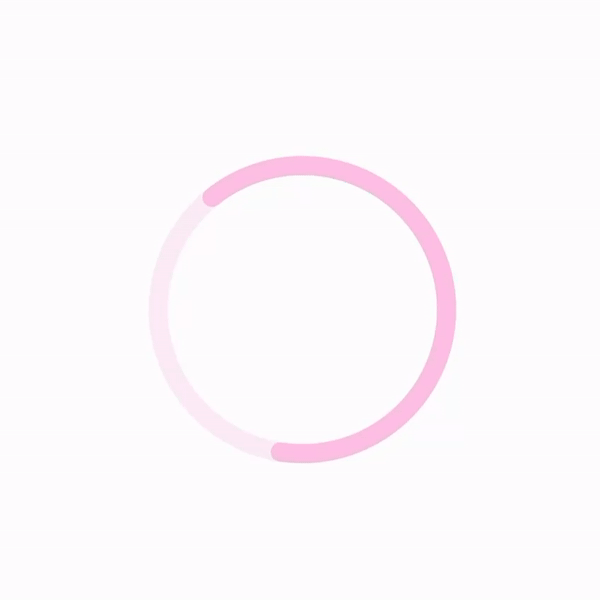

# react-native-lottie-ui

`react-native-lottie-ui` is a collection of reusable React Native components that utilize Lottie animations, designed to
streamline development and enhance the UI/UX of your projects. This package contains components that have been
repeatedly useful in various projects, and have now been consolidated into a single, convenient package.

## Installation

You can install `react-native-lottie-ui` via npm or yarn:

```bash
npm install react-native-lottie-ui
```

or

```bash
yarn add react-native-lottie-ui
```

## LoadingStatusIndicator

<p align='center'>
  
</p>

| Prop Name               | Type          | Description                                               | Default   |
|-------------------------|---------------|-----------------------------------------------------------|-----------|
| `size`                  | `number`      | Height and width of the loader icons.                     | 54px      |
| `isLoading`             | `boolean`     | Indicates if the loading animation should be played.      | true      |
| `isSuccess`             | `boolean`     | Indicates if the success animation should be played.      | false     |
| `isFailed`              | `boolean`     | Indicates if the failure animation should be played.      | false     |
| `contentContainerStyle` | `ViewStyle`   | Style to apply to the container of the loading indicator. | undefined |
| `loaderColor`           | `LottieColor` | Color of the loader in RGB format.                        | [0, 0, 0] |
| `errorColor`            | `LottieColor` | Color to indicate error state in RGB format.              | [0, 0, 0] |
| `successColor`          | `LottieColor` | Color to indicate success state in RGB format.            | [0, 0, 0] |

## HeartToggle

<p align='center'>
  
</p>

| Prop          | Type                                                 | Description                                                                           | Default Value     |
|---------------|------------------------------------------------------|---------------------------------------------------------------------------------------|-------------------|
| `isActive`    | `boolean`                                            | Indicates if the heart animation should be in its active state. Default is `false`.   | `false`           |
| `color`       | `LottieColor`                                        | Color of the heart in its default (inactive) state. Should be an array of RGB values. | `[147, 147, 147]` |
| `activeColor` | `LottieColor`                                        | Color of the heart in its active state. Should be an array of RGB values.             | `[207, 6, 6]`     |
| `...`         | `Omit<LottieViewProps, 'ref' \| 'loop' \| 'source'>` | Other props from `LottieViewProps`, excluding `'ref'`, `'loop'`, and `'source'`.      | -                 |


